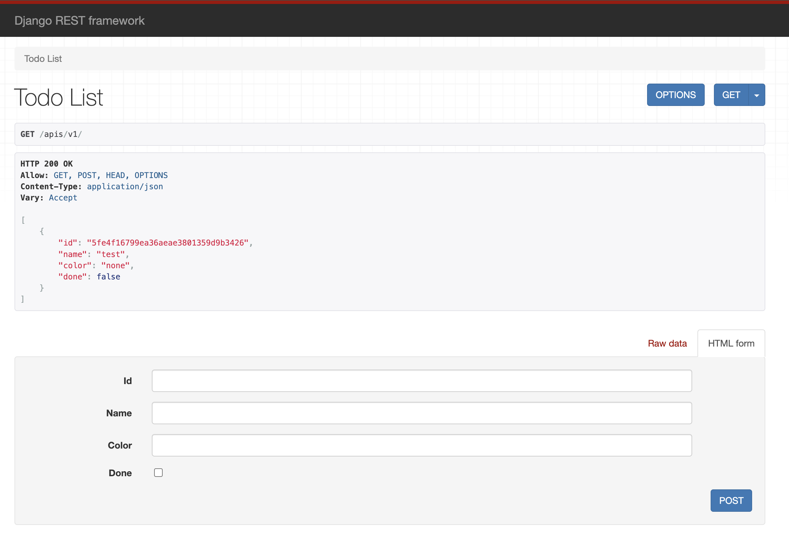

# Django Server for Todo List
### To start the Django development server

1. Start a virtual environment

```
python3 -m venv venv     
source venv/bin/activate  
```
2. Install the required packages
```
pip install -r requirements.txt       
```
3. Run server
```
python manage.py runserver
```

Expected output
```
Starting development server at http://127.0.0.1:8000/
Quit the server with CONTROL-C.
```
Endpoint: `/apis/v1`
